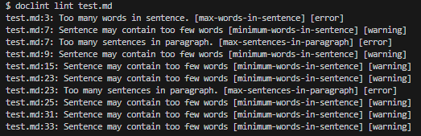

# Technical Documentation Linter

## Example Output

## Development Plan
- Phase 1 is complete
- Phase 2 is in development

### Phase 1
- CLI with markdown file parsing.
- Basic rules:
    -  heading case
    -  banned phrases
    - max/min words in sentence
    - max sentences in paragraph
- Configuration file support
- Text output file for results

### Phase 2
- Grammar and spelling rules
- JSON output
- CI Pipeline
- Tests

### Phase 3
- User-defined rules
- Genre based configuration profiles (i.e. User manuals, functional specs, etc.)
- Error correction suggestions

### Future Features
- AutoFix for simple issues
- GUI and/or web dashboard
- Live VSCode linting in editors as a plugin
